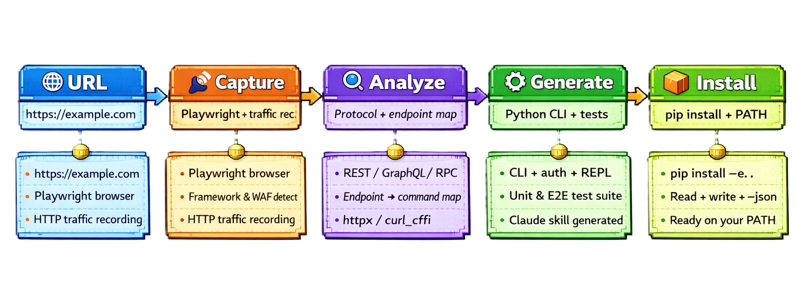

<p align="center">
  
</p>

<p align="center">
  <strong>Turn any website into a production-grade CLI — automatically.</strong>
</p>

<p align="center">
  <a href="#quick-start">Quick Start</a> &nbsp;&bull;&nbsp;
  <a href="#examples">Examples</a> &nbsp;&bull;&nbsp;
  <a href="#how-it-works">How It Works</a> &nbsp;&bull;&nbsp;
  <a href="#commands">Commands</a> &nbsp;&bull;&nbsp;
  <a href="#contributing">Contributing</a>
</p>

<p align="center">
  <a href="LICENSE"></a>
  <a href="https://github.com/ItamarZand88/CLI-Anything-WEB/stargazers"></a>
  <a href="https://github.com/ItamarZand88/CLI-Anything-WEB/issues"></a>
  
  
</p>

---

**CLI-Anything-Web** is a [Claude Code](https://docs.anthropic.com/en/docs/claude-code) plugin that generates production-grade Python CLIs for **any** web application by capturing its live HTTP traffic. Point it at a URL, and get a fully working CLI on your PATH — with auth, REPL mode, `--json` output, and tests.

> **Experimental Project — Use Responsibly**
>
> This project uses **undocumented web APIs** reverse-engineered from live HTTP traffic. These APIs can change without notice.
>
> - **Not affiliated with any website** — This is an independent open-source project
> - **APIs may break** — Websites can change their internal endpoints, HTML structure, or add protections at any time
> - **Respect rate limits** — Generated CLIs include exponential backoff, but heavy usage may be throttled
> - **For personal use** — Best suited for prototyping, automation, research, and personal productivity
>
> Generated CLIs interact with real production services. Use them responsibly and in accordance with each website's terms of service.

<br>

## The Idea

Most web apps don't have public APIs. **CLI-Anything-Web** changes that — it opens a browser, captures the network traffic, reverse-engineers the API, and generates a complete CLI tool you can use from the terminal or pipe into other agents.

```
You: /cli-anything-web https://suno.com

Claude: Opens browser → captures API traffic → analyzes endpoints →
        generates cli-web-suno with auth, 14 commands, REPL mode, tests

You: cli-web-suno songs generate --description "jazz ballad about rain"
```

> No API docs needed. No reverse-engineering by hand. Just point and generate.

<br>

## Quick Start

### Prerequisites

| Requirement | Version |
|------------|---------|
| [Claude Code](https://docs.anthropic.com/en/docs/claude-code) | With plugin support |
| [Node.js](https://nodejs.org/) | For playwright-cli (traffic capture) |
| [Python](https://python.org/) | 3.10+ |

### Install

```bash
# Inside Claude Code
/plugin marketplace add ItamarZand88/CLI-Anything-WEB
/plugin install cli-anything-web
/reload-plugins
```

### Generate Your First CLI

```bash
/cli-anything-web https://monday.com
```

The agent opens a browser, asks you to log in if needed, captures traffic, and generates a complete CLI. That's it.

<br>

## Examples

Real CLIs generated by the plugin, shipped in this repo as reference implementations:

| CLI | Website | Protocol | Auth | Description |
|-----|---------|----------|------|-------------|
| [`cli-web-futbin`](futbin/) | FUTBIN | HTML + JSON API | None | EA FC 26 player database — search, compare, prices |
| [`cli-web-notebooklm`](notebooklm/) | Google NotebookLM | batchexecute RPC | Google SSO | Notebooks, sources, chat, artifacts (audio, video, slides, quiz, mindmap) |
| [`cli-web-gh-trending`](gh-trending/) | GitHub Trending | HTML scraping | None | Trending repos & developers with language/time filters |
| [`cli-web-producthunt`](producthunt/) | Product Hunt | HTML scraping (curl_cffi) | None | Today's launches, leaderboards, product details |
| [`cli-web-unsplash`](unsplash/) | Unsplash | REST API (curl_cffi) | None | Photo search, download, topics, collections, profiles |
| [`cli-web-booking`](booking/) | Booking.com | GraphQL + HTML scraping (curl_cffi) | WAF cookies | Hotel search, property details, destination resolution |

### Try Them

```bash
# GitHub Trending — no auth required, great first test
cd gh-trending/agent-harness && pip install -e .
cli-web-gh-trending repos list --language python --since weekly

# FUTBIN — search EA FC players
cd futbin/agent-harness && pip install -e .
cli-web-futbin players search --name "Messi" --json

# NotebookLM — requires Google login
cd notebooklm/agent-harness && pip install -e .
cli-web-notebooklm auth login
cli-web-notebooklm notebooks list

# Product Hunt — no auth, bypasses Cloudflare
cd producthunt/agent-harness && pip install -e .
cli-web-producthunt posts list --json

# Unsplash — no auth, REST API
cd unsplash/agent-harness && pip install -e .
cli-web-unsplash photos search "mountains" --json

# Booking.com — WAF cookies, hybrid GraphQL + HTML scraping
cd booking/agent-harness && pip install -e .
cli-web-booking autocomplete "Paris" --json
cli-web-booking search find "Paris" --checkin 2026-04-01 --checkout 2026-04-04 --json
```

Every generated CLI drops into an **interactive REPL** when run with no arguments:

```
$ cli-web-gh-trending
gh-trending> repos list --language rust --since monthly
gh-trending> developers list --language python
gh-trending> exit
```

<br>

## How It Works

The plugin runs a 4-phase pipeline, fully automated by Claude:

<p align="center">
  
</p>

<br>

## What Every Generated CLI Includes

| Feature | Details |
|---------|---------|
| **Click commands** | `cli-web-<app> <group> <command> [options]` |
| **Interactive REPL** | Run with no args — history, autocomplete, colored output |
| **`--json` output** | Machine-readable output for piping into other tools or agents |
| **Auth management** | Python Playwright browser login → cookie extraction → `auth.json` |
| **Error handling** | Typed exception hierarchy with structured JSON error responses |
| **Tests** | Unit tests (mocked) + E2E tests (live API) + subprocess tests |
| **Installable** | `pip install -e .` puts it on your PATH immediately |

<br>

## Commands

| Command | Description |
|---------|-------------|
| `/cli-anything-web <url>` | Full pipeline — capture, analyze, generate, publish |
| `/cli-anything-web:record <url>` | Capture traffic only (for exploration) |
| `/cli-anything-web:refine <path>` | Add more commands to an existing CLI |
| `/cli-anything-web:test <path>` | Run tests and update TEST.md |
| `/cli-anything-web:validate <path>` | Validate against quality standards |
| `/cli-anything-web:list` | List all generated CLIs |

<br>

## Supported Protocols

The plugin auto-detects and handles multiple web architectures:

| Protocol | Example Sites |
|----------|--------------|
| REST / JSON API | Monday.com, Dev.to, most modern SPAs |
| Server-rendered HTML | GitHub, FUTBIN, Hacker News |
| Cloudflare-protected HTML | Product Hunt (via curl_cffi TLS impersonation) |
| GraphQL | Shopify, GitHub API v4 |
| GraphQL + AWS WAF | Booking.com (curl_cffi + WAF cookie bypass) |
| gRPC-Web | Google apps (internal) |
| Google batchexecute | NotebookLM, Google Docs, Keep |

<br>

## Repository Structure

```
CLI-Anything-WEB/
├── cli-anything-web-plugin/     # The installable Claude Code plugin
│   ├── .claude-plugin/          # Plugin manifest
│   ├── commands/                # Slash command definitions
│   ├── skills/                  # Phase-specific skill instructions
│   │   ├── capture/             #   Phase 1: browser + traffic capture
│   │   ├── methodology/         #   Phase 2: analysis + code generation
│   │   ├── testing/             #   Phase 3: test generation
│   │   └── standards/           #   Phase 4: validation + publishing
│   ├── scripts/                 # Shared utilities (trace parser, REPL skin)
│   └── HARNESS.md               # Complete methodology SOP
│
├── futbin/                      # Example: FUTBIN (HTML scraping + JSON)
├── notebooklm/                  # Example: NotebookLM (Google batchexecute RPC)
├── gh-trending/                 # Example: GitHub Trending (HTML scraping)
├── producthunt/                 # Example: Product Hunt (curl_cffi)
├── unsplash/                    # Example: Unsplash (REST API + curl_cffi)
└── booking/                     # Example: Booking.com (GraphQL + AWS WAF)
```

<br>

## Inspiration

This project is directly inspired by [CLI-Anything](https://github.com/HKUDS/CLI-Anything) by HKUDS — a Claude Code plugin that makes **desktop software** (GIMP, Blender, LibreOffice, OBS Studio) agent-native by analyzing source code and generating CLI wrappers.

**CLI-Anything-Web** extends the same vision to the **web** — where there's no source code to analyze, only live HTTP traffic to capture.

| | [**CLI-Anything**](https://github.com/HKUDS/CLI-Anything) | **CLI-Anything-Web** |
|---|---|---|
| **Target** | Desktop apps (GIMP, Blender, OBS, LibreOffice) | Web apps (NotebookLM, Booking.com, any website) |
| **Input** | Source code, GUI APIs, plugin systems | Live HTTP traffic from browser |
| **Analysis** | Static code analysis + API mapping | Network traffic capture + protocol detection |
| **Protocols** | Python APIs, DBus, CLI wrappers | REST, GraphQL, batchexecute RPC, HTML scraping |
| **Auth** | N/A (local software) | Browser login, cookies, WAF bypass, API keys |
| **Challenges** | API surface discovery, state management | Anti-bot protection, undocumented APIs, session expiry |
| **Output** | Same: Click CLI + REPL + `--json` + tests | Same: Click CLI + REPL + `--json` + tests |

Together they cover the full spectrum: **CLI-Anything** handles desktop software, **CLI-Anything-Web** handles the web. Same CLI architecture, same agent-native philosophy, different domains.

<br>

## What's Next

We're actively building more CLIs and improving the plugin. Here's what's coming:

- **More example CLIs** — Jira, Notion, Monday.com, Spotify, LinkedIn
- **Audio/video generation** — Suno, ElevenLabs, Midjourney
- **Smarter traffic analysis** — Auto-detect auth flows, pagination patterns, WebSocket streams
- **CI/CD integration** — Run generated CLIs in GitHub Actions with env-var auth
- **Community CLI registry** — Share and install CLIs built by other users

Want to see a specific website supported? [Open an issue](https://github.com/ItamarZand88/CLI-Anything-WEB/issues/new) with the URL.

<br>

## Contributing

We'd love your help! The easiest ways to contribute:

**Build a CLI for a new website** — Run `/cli-anything-web <url>` on any site you use daily, fix any issues, and submit a PR. Your CLI becomes a reference implementation that helps others.

**Improve the plugin** — The pipeline skills in `cli-anything-web-plugin/skills/` contain the methodology. Found a pattern the plugin doesn't handle? Add it.

**Report bugs** — If a generated CLI breaks (website changed their API, anti-bot protection added), [open an issue](https://github.com/ItamarZand88/CLI-Anything-WEB/issues). Include the `--json` output so we can diagnose.

```bash
# Standard contribution flow
git clone https://github.com/ItamarZand88/CLI-Anything-WEB.git
cd CLI-Anything-WEB
git checkout -b feat/my-feature
# ... make changes ...
bash cli-anything-web-plugin/verify-plugin.sh  # validate
git push origin feat/my-feature
# Open a PR
```

<br>

## Star History

If this project is useful to you, consider giving it a star. It helps others discover it.

<p align="center">
  <a href="https://github.com/ItamarZand88/CLI-Anything-WEB/stargazers">
    
  </a>
  &nbsp;
  <a href="https://github.com/ItamarZand88/CLI-Anything-WEB/network/members">
    
  </a>
  &nbsp;
  <a href="https://github.com/ItamarZand88/CLI-Anything-WEB/issues">
    
  </a>
</p>

<br>

## License

This project is licensed under the [MIT License](LICENSE).

---

<p align="center">
  Built with <a href="https://docs.anthropic.com/en/docs/claude-code">Claude Code</a> &nbsp;|&nbsp;
  Inspired by <a href="https://github.com/HKUDS/CLI-Anything">CLI-Anything</a>
</p>
