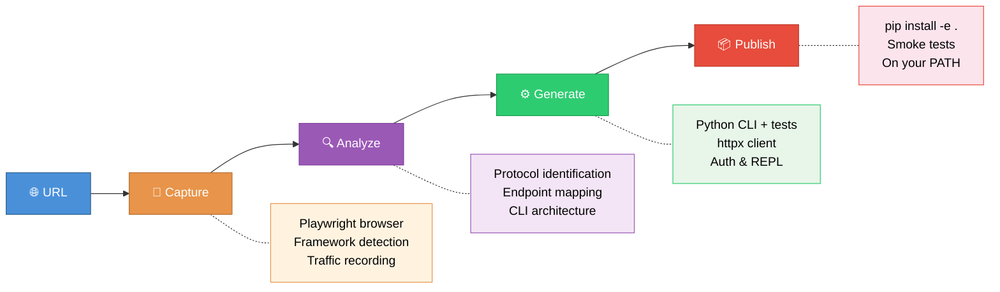

<p align="center">
  
</p>

<p align="center">
  <strong>Turn any website into a production-grade CLI — automatically.</strong>
</p>

<p align="center">
  <a href="#quick-start">Quick Start</a> &nbsp;&bull;&nbsp;
  <a href="#examples">Examples</a> &nbsp;&bull;&nbsp;
  <a href="#how-it-works">How It Works</a> &nbsp;&bull;&nbsp;
  <a href="#commands">Commands</a> &nbsp;&bull;&nbsp;
  <a href="#contributing">Contributing</a>
</p>

<p align="center">
  <a href="LICENSE"></a>
  <a href="https://github.com/ItamarZand88/CLI-Anything-WEB/stargazers"></a>
  <a href="https://github.com/ItamarZand88/CLI-Anything-WEB/issues"></a>
  
  
</p>

---

**CLI-Anything-Web** is a [Claude Code](https://docs.anthropic.com/en/docs/claude-code) plugin that generates production-grade Python CLIs for **any** web application by capturing its live HTTP traffic. Point it at a URL, and get a fully working CLI on your PATH — with auth, REPL mode, `--json` output, and tests.

<br>

## The Idea

Most web apps don't have public APIs. **CLI-Anything-Web** changes that — it opens a browser, captures the network traffic, reverse-engineers the API, and generates a complete CLI tool you can use from the terminal or pipe into other agents.

```
You: /cli-anything-web https://suno.com

Claude: Opens browser → captures API traffic → analyzes endpoints →
        generates cli-web-suno with auth, 14 commands, REPL mode, tests

You: cli-web-suno songs generate --description "jazz ballad about rain"
```

> No API docs needed. No reverse-engineering by hand. Just point and generate.

<br>

## Quick Start

### Prerequisites

| Requirement | Version |
|------------|---------|
| [Claude Code](https://docs.anthropic.com/en/docs/claude-code) | With plugin support |
| [Node.js](https://nodejs.org/) | For playwright-cli |
| [Python](https://python.org/) | 3.10+ |

### Install

```bash
# Inside Claude Code
/plugin marketplace add ItamarZand88/CLI-Anything-WEB
/plugin install cli-anything-web
/reload-plugins
```

### Generate Your First CLI

```bash
/cli-anything-web https://monday.com
```

The agent opens a browser, asks you to log in if needed, captures traffic, and generates a complete CLI. That's it.

<br>

## Examples

Real CLIs generated by the plugin, shipped in this repo as reference implementations:

| CLI | Website | Protocol | Auth | Description |
|-----|---------|----------|------|-------------|
| [`cli-web-futbin`](futbin/) | FUTBIN | HTML + JSON API | None | EA FC 26 player database — search, compare, prices |
| [`cli-web-notebooklm`](notebooklm/) | Google NotebookLM | batchexecute RPC | Google SSO | Create notebooks, add sources, generate artifacts |
| [`cli-web-gh-trending`](gh-trending/) | GitHub Trending | HTML scraping | None | Trending repos & developers with language/time filters |
| [`cli-web-producthunt`](producthunt/) | Product Hunt | HTML scraping (curl_cffi) | None | Today's launches, leaderboards, product details |

### Try Them

```bash
# GitHub Trending — no auth required, great first test
cd gh-trending/agent-harness && pip install -e .
cli-web-gh-trending repos list --language python --since weekly

# FUTBIN — search EA FC players
cd futbin/agent-harness && pip install -e .
cli-web-futbin players search --name "Messi" --json

# NotebookLM — requires Google login
cd notebooklm/agent-harness && pip install -e .
cli-web-notebooklm auth login
cli-web-notebooklm notebooks list

# Product Hunt — no auth, bypasses Cloudflare
cd producthunt/agent-harness && pip install -e .
cli-web-producthunt posts list --json
```

Every generated CLI drops into an **interactive REPL** when run with no arguments:

```
$ cli-web-gh-trending
gh-trending> repos list --language rust --since monthly
gh-trending> developers list --language python
gh-trending> exit
```

<br>

## How It Works

The plugin runs a 4-phase pipeline, fully automated by Claude:



<br>

## What Every Generated CLI Includes

| Feature | Details |
|---------|---------|
| **Click commands** | `cli-web-<app> <group> <command> [options]` |
| **Interactive REPL** | Run with no args — history, autocomplete, colored output |
| **`--json` output** | Machine-readable output for piping into other tools or agents |
| **Auth management** | Browser login → cookie extraction → `auth.json` storage |
| **Error handling** | Typed exception hierarchy with structured JSON error responses |
| **Tests** | Unit tests (mocked) + E2E tests (live API) + subprocess tests |
| **Installable** | `pip install -e .` puts it on your PATH immediately |

<br>

## Commands

| Command | Description |
|---------|-------------|
| `/cli-anything-web <url>` | Full pipeline — capture, analyze, generate, publish |
| `/cli-anything-web:record <url>` | Capture traffic only (for exploration) |
| `/cli-anything-web:refine <path>` | Add more commands to an existing CLI |
| `/cli-anything-web:test <path>` | Run tests and update TEST.md |
| `/cli-anything-web:validate <path>` | Validate against quality standards |
| `/cli-anything-web:list` | List all generated CLIs |

<br>

## Supported Protocols

The plugin auto-detects and handles multiple web architectures:

| Protocol | Example Sites |
|----------|--------------|
| REST / JSON API | Monday.com, Dev.to, most modern SPAs |
| Server-rendered HTML | GitHub, FUTBIN, Hacker News |
| Cloudflare-protected HTML | Product Hunt (via curl_cffi TLS impersonation) |
| GraphQL | Shopify, GitHub API v4 |
| gRPC-Web | Google apps (internal) |
| Google batchexecute | NotebookLM, Google Docs, Keep |

<br>

## Repository Structure

```
CLI-Anything-WEB/
├── cli-anything-web-plugin/     # The installable Claude Code plugin
│   ├── .claude-plugin/          # Plugin manifest
│   ├── commands/                # Slash command definitions
│   ├── skills/                  # Phase-specific skill instructions
│   │   ├── capture/             #   Phase 1: browser + traffic capture
│   │   ├── methodology/         #   Phase 2: analysis + code generation
│   │   ├── testing/             #   Phase 3: test generation
│   │   └── standards/           #   Phase 4: validation + publishing
│   ├── scripts/                 # Shared utilities (trace parser, REPL skin)
│   └── HARNESS.md               # Complete methodology SOP
│
├── futbin/                      # Example: FUTBIN (HTML scraping + JSON)
├── notebooklm/                  # Example: NotebookLM (Google batchexecute RPC)
├── gh-trending/                 # Example: GitHub Trending (HTML scraping)
└── producthunt/                 # Example: Product Hunt
```

<br>

## Contributing

Contributions are welcome! Whether it's a new example CLI, a plugin improvement, or a bug fix:

1. **Fork** the repo
2. **Create** a feature branch (`git checkout -b feat/my-feature`)
3. **Make** your changes
4. **Validate** the plugin: `bash cli-anything-web-plugin/verify-plugin.sh`
5. **Submit** a PR

<br>

## License

This project is licensed under the [MIT License](LICENSE).

---

<p align="center">
  Built with <a href="https://docs.anthropic.com/en/docs/claude-code">Claude Code</a>
</p>
